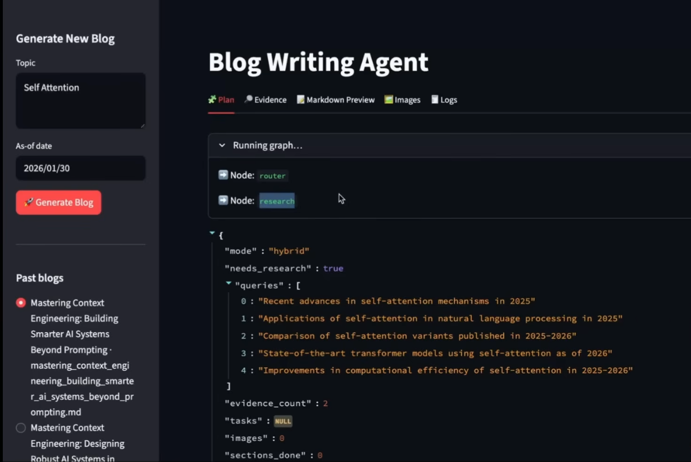
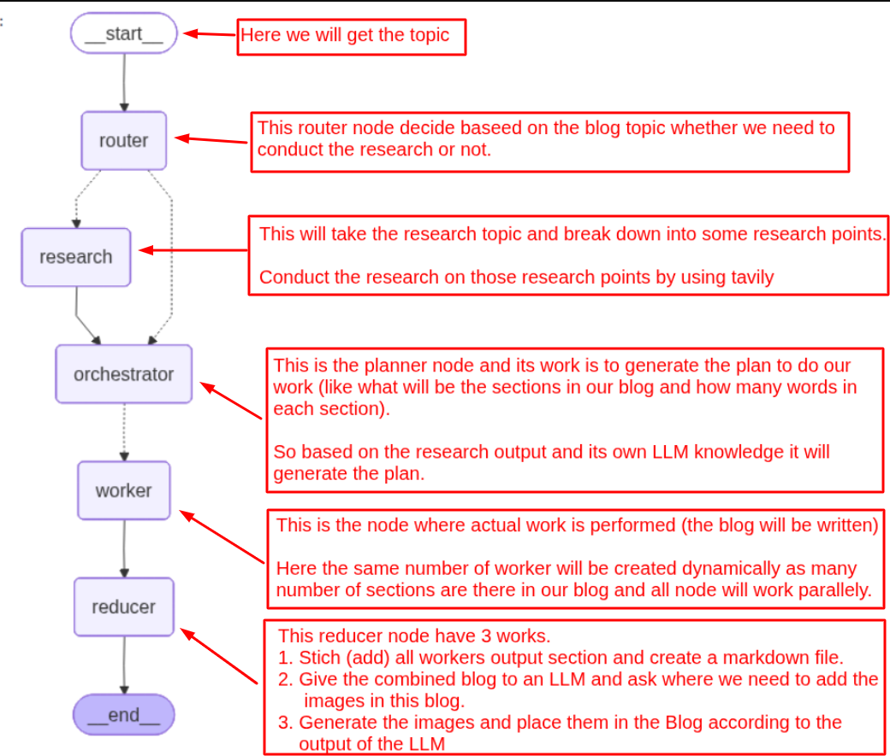
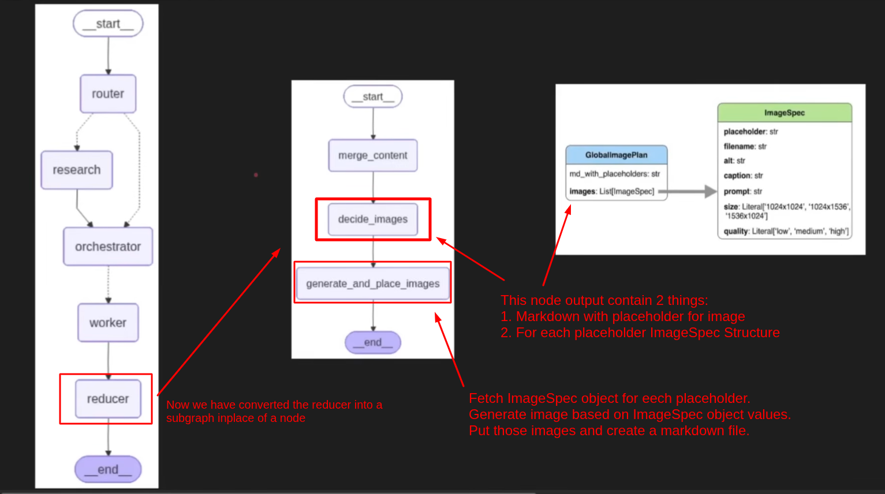

## Planning Agent

- A planning agent is an AI agent that does not immediately jump to answering or acting.

- Instead, it first create a structured plan of what needs to be done, and then executes that plan step-by-step.

- Planning agents are useful when tasks are:

    - Long and multi-step
    - Require structure (blogs, projects, apps)

- Planning agents works in 2 phases:

    - **Phase 1: Plan**

        - Break the task into clear steps or sub-tasks.

    - **Phase 2: Execute**

        - Complete each step systematically, often checking progress.

----

### Porject: Blog Writing Agent

- We will give a topic to the agent and then agent will create a detailed Blog on that topic.

- This project has capibility or feature of research on a topic in real time

- This project also had capibility of adding the images in the blog.

- We can download the blog along with the images.



----

### Project Architecture 



----

### Reducer Sub-Graph



----

### LangGraph Stream method

```bash
graph_app.stream(inputs, stream_mode="updates")
```

- Here, *inputs* is the GraphState dictionary we have.

- *stream_mode="updates"* Runs the graph step-by-step, and after each node finishes executing, it yields a small dict showing just what that node changed in the state

- Each item is {node_name: {keys_that_node_updated: new_values}} — not the full state, just the delta. 

----

- *stream_mode="values"* — yields the full state after each step

- *stream_mode="messages"* — yields LLM token/message streaming events

- *stream_mode="debug"* — yields detailed execution info

----

### How we are going to build the project

- We will build the complete project in 4 stages:

    1. Create basic blog writing agent.
    
    2. Add the research phase in our project
    
    3. Add the image in our blog.
    
    4. Add the GUI for our project.
